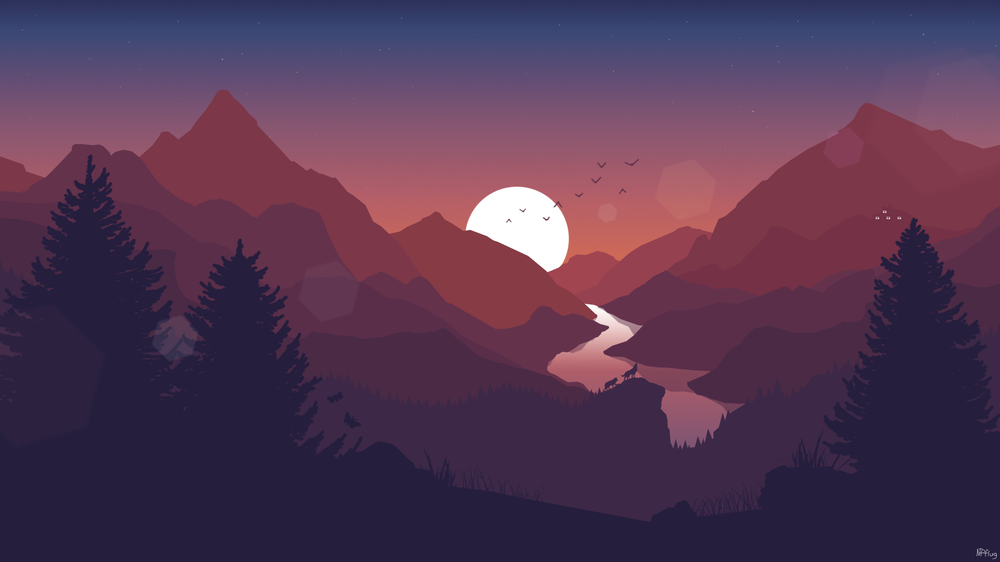
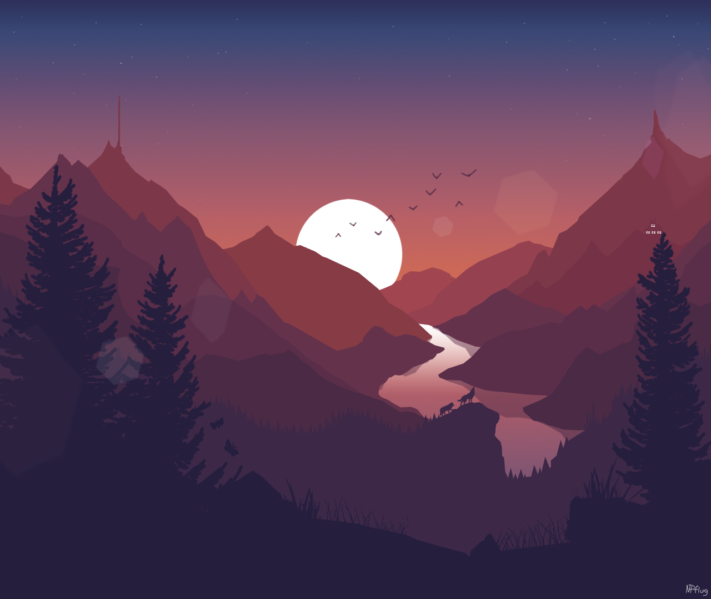

# Seam Carving

Carve out low energy seams on an image.

The actual seam energy calculation is done without dependencies.

Initially this project has a dependency on [`image`](https://github.com/image-rs/image) crate, to open and save images.

### Original Image

Dimensions: 1920x1080

Credit: [SentryTV](https://www.reddit.com/user/SentryTV/)

### Seam carved

Dimensions: 1280x1080

- 66.66% of original width.

